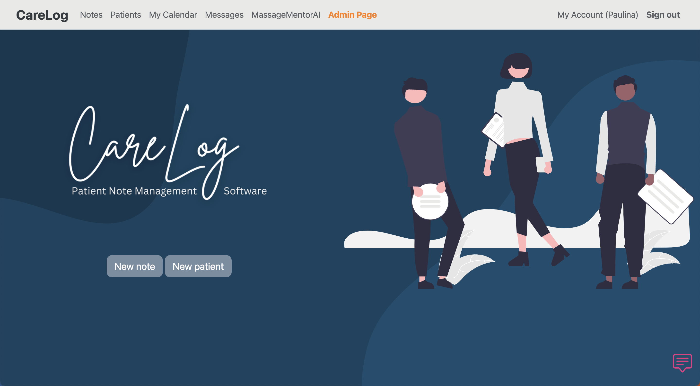

# CareLog

<a href="https://carelog.onrender.com/">View demo</a>

## About the project

## Created with
* Ruby on Rails
* HTML
* CSS
* Bootstrap
* tiniest bit of JavaScript

## Idea
I used to work for a chiropractic office that used zero software to help their massage therapists manage their session notes. When I started my software development program I realized it woluld be a great idea to practice my skills by creating such app for my final project.

### Key features
* session notes management
* patient information
* calendar
* messaging between the users
* admin page
* AI Assistant 
* mobile friendly

## Acknowledgments 

Classroom training provided by <a href="https://dpi.uillinois.edu/">Discovery Partners Institute</a>
